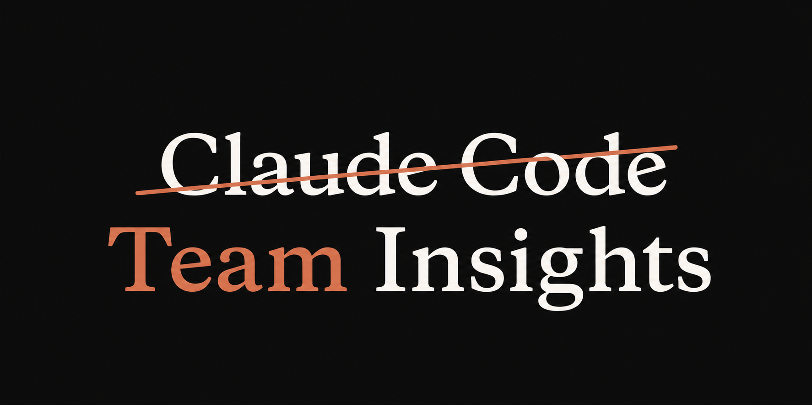

# Claude Impact Lab — Team Collaboration Assessment



A three-part system for **measuring, scoring, and facilitating** team collaboration:
turn heterogeneous team artifacts (transcripts, Slack, PRs, retros, standups) into a rubric-based
health assessment, a live in-meeting facilitator, and a metric-contract dashboard — with a
synthetic before/after dataset that provides ground truth for validating the tools.

---

## Presentation

- **[`docs/Team_Insights_5_Slides.pdf`](docs/Team_Insights_5_Slides.pdf)** — the 5-slide
  walk-through deck. Covers the problem, the rubric, the assessment loop, and the demo tour.

---

## The three layers

The system is one product in three layers. They collide only through one contract: **measurement
is computed once, in the middle layer, and both neighbours consume it.** See
[`docs/superpowers/specs/2026-08-04-facilitator-and-scorer-integration.md`](docs/superpowers/specs/2026-08-04-facilitator-and-scorer-integration.md)
for the boundary rules.

| Layer | Job | Timescale | Where it lives |
|---|---|---|---|
| **Participate** | Reframe the goal, balance voices, draw out the opposing view | Live, in the room | [`team-insights/`](team-insights/) |
| **Measure** | Compute the metric contract, nudge, produce readouts | Live and per meeting | [`demo/`](demo/) |
| **Score** | Apply the Five Dysfunctions rubric, persist snapshots, report trends | Per period (quarterly) | [`team-assess/`](team-assess/) |

### Frontend — live facilitation and metric dashboard

Two browser demos, both zero-dependency static apps.

- **[`team-insights/`](team-insights/README.md)** — the classroom / group agent facilitator
  (PRD 06). One button starts a session; between each speaker it puts one sharp question on the
  full screen. The goal restates itself out loud, and the meeting document writes itself.
  `npm start` on a static server.

- **[`demo/`](demo/README.md)** — the metric-contract replay dashboard (PRD 05). Replays a real
  meeting transcript from the Aurora Skills dataset at 15×/60×/240× and runs four collaboration
  rules (talk-time balance, silence-is-not-absence, questions-are-participation, interruption)
  as the transcript arrives. Rubric marks dock in a second rail as the replay reaches the turns
  they cite. `python3 build_demo_data.py && open index.html`.

### Middle layer — the assessment tool

- **[`team-assess/`](team-assess/)** — Python CLI that ingests heterogeneous team artifacts,
  scores them against an externalized Five Dysfunctions rubric via Claude (tool-use), persists
  snapshots, and renders a before/after trend report in Markdown.

  ```
  team-assess/
    rubric/five-dysfunctions.yaml   # externalized rubric, v0.9 (27 facets)
    ingestion/                       # readers for txt/md/csv/json/pdf + recursive scanner
    prompts/builder.py               # dynamic scoring prompt from rubric
    scorer/claude_scorer.py          # Claude API tool-use, facet aggregation, trend embedding
    snapshots/                       # persisted point-in-time assessments (JSON)
    output/                          # generated Markdown reports
    trend/                           # unused — pipeline embeds trend at scoring time
    renderer/markdown.py             # snapshot → Markdown report
    assess.py                        # CLI entrypoint
  ```

  Run:
  ```bash
  cd team-assess
  export ANTHROPIC_API_KEY=...
  python3 assess.py --input ../simulated-data/aurora-skills/before-q2-2026 --period aurora-q2-2026
  python3 assess.py --input ../simulated-data/aurora-skills/after-q3-2026  --period aurora-q3-2026 --compare aurora-q2-2026
  ```

  Design spec: [`docs/superpowers/specs/2026-08-04-team-dysfunction-rubric-design.md`](docs/superpowers/specs/2026-08-04-team-dysfunction-rubric-design.md).
  Sample outputs: [`team-assess/output/`](team-assess/output/), [`team-assess/snapshots/`](team-assess/snapshots/).

### Simulated data — Aurora Skills

- **[`simulated-data/aurora-skills/`](simulated-data/aurora-skills/README.md)** — one fictional
  org, 12 people, two quarters (Q2 2026 *before*, Q3 2026 *after*), with the same team measurably
  improving between quarters. Includes real-format Slack exports, WebVTT transcripts with
  diarization, PR review threads, issue tracker data, standups, retros, and pulse surveys.
  Every seeded signal maps to a rubric v0.9 dimension + facet + verbatim act in
  [`ground_truth.json`](simulated-data/aurora-skills/ground_truth.json).

  The whole point is the **before → after delta on the same team**: it's the story a scoring
  rubric can verify. Regenerate deterministically with `python3 generate.py`.

- **[`rubric/`](rubric/)** — the OBM Behavior Coding Reference (120 observable behaviors, 27
  facets) that the rubric YAML is drawn from. `obm-behavior-codes.md` is canonical;
  `obm-behavior-codes.json` is generated by `build_codes.py`.

---

## How the specs were built

The rubric taxonomy and process specs in [`docs/superpowers/specs/`](docs/superpowers/specs/)
were produced via a tiered literature-review pipeline documented in
[`Pipeline_Spec.md`](docs/superpowers/specs/Pipeline_Spec.md). The pipeline:

1. **Tier 1 (Sonnet)** — broad reconnaissance of the landscape, structured output, 25-fetch cap
2. **Gate 1** — Haiku extraction of hypothesis/priorities/gaps → user redirection injected as an
   **Operator Directive** at the top of the next stage's prompt
3. **Tier 2 (Sonnet)** — deep investigation against primary sources, honest reconciliation of
   misfits, CONFIRMED/LIKELY/UNRESOLVED confidence tagging
4. **Gate 2** — checkpoint decision + design questions → second Operator Directive
5. **Tier 3 (Opus)** — synthesis into the final deliverable (`OBM_Behavior_Taxonomy.md`), with
   judgment calls logged inline
6. **Post-deliverable revision passes (Sonnet)** — reliability tightening, intervention design,
   dense reformatting

The **simulated data workflow** — how to generate a ground-truth-tagged synthetic corpus that a
scoring tool can be validated against — is documented in
[`2026-08-05-simulated-team-data-workflow.md`](docs/superpowers/specs/2026-08-05-simulated-team-data-workflow.md).

Other key specs:

- [`2026-08-04-team-dysfunction-rubric-design.md`](docs/superpowers/specs/2026-08-04-team-dysfunction-rubric-design.md) — team-assess design
- [`2026-08-04-facilitator-and-scorer-integration.md`](docs/superpowers/specs/2026-08-04-facilitator-and-scorer-integration.md) — how the three layers fit together
- [`OBM_Behavior_Taxonomy_Coding_Reference.md`](docs/superpowers/specs/OBM_Behavior_Taxonomy_Coding_Reference.md) — the canonical 120-behavior taxonomy the rubric YAML is drawn from
- [`2026-08-04-open-questions.md`](docs/superpowers/specs/2026-08-04-open-questions.md) — unresolved design questions

The PRDs for the six Aurora Skills product surfaces live in
[`simulated-data/aurora-skills/prds/`](simulated-data/aurora-skills/prds/).

---

## The assessment loop

The dataset and the tool form a closed loop that validates the whole system:

```
team-assess scores Q2  →  emits recommendations  →  team enacts them in Q3
                                                              ↓
team-assess scores Q3  ←  Q3 artifacts answer each anticipated recommendation
                    (improvement should appear on the targeted dimensions)
```

The Q2 dysfunctions are seeded and located; the Q3 content is authored to answer each anticipated
recommendation, so a correct scorer should rate Q3 higher than Q2 on exactly the targeted
dimensions. Full mapping in
[`simulated-data/aurora-skills/ground_truth.json` → `assessment_loop`](simulated-data/aurora-skills/ground_truth.json)
and [`simulated-data/aurora-skills/assessments/`](simulated-data/aurora-skills/assessments/).

Sample assessments generated by `team-assess` against Aurora Skills:

- [`team-assess/snapshots/aurora-q2-2026.json`](team-assess/snapshots/aurora-q2-2026.json)
- [`team-assess/snapshots/aurora-q3-2026.json`](team-assess/snapshots/aurora-q3-2026.json)
- [`team-assess/output/report-aurora-q2-2026.md`](team-assess/output/report-aurora-q2-2026.md)
- [`team-assess/output/report-aurora-q3-2026.md`](team-assess/output/report-aurora-q3-2026.md)

---

## Repository layout

```
claude-education/
├── team-assess/           # Python CLI: rubric-based assessment tool (middle layer)
├── team-insights/         # Static web app: live facilitator (frontend, participate)
├── demo/                  # Static web app: metric-contract replay (frontend, measure)
├── simulated-data/        # Aurora Skills before/after dataset + ground truth
├── rubric/                # OBM Behavior Coding Reference (source of rubric YAML)
├── docs/superpowers/specs/  # design specs, integration notes, pipeline documentation
└── claude-impact-lab-logo.png
```
